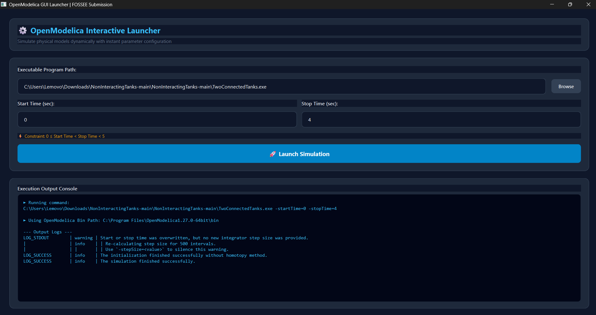
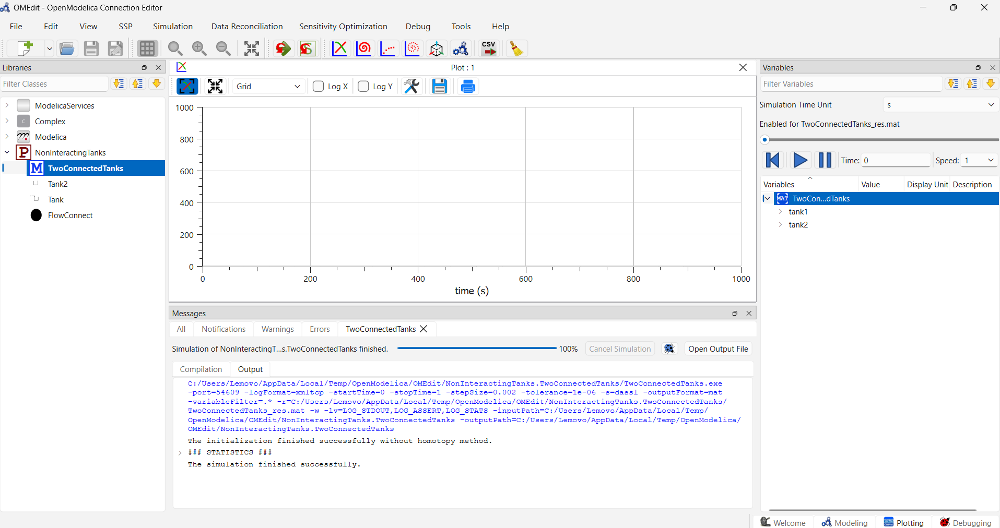
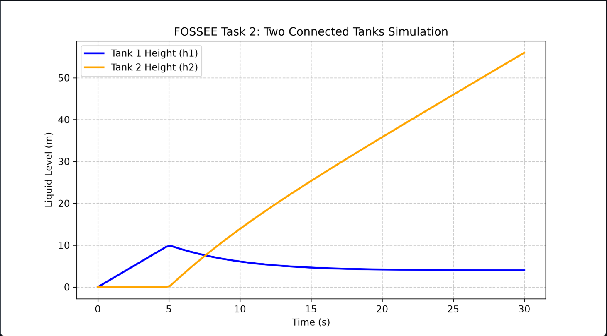

# Automated Simulation and Analysis of a Non-Interacting Two-Tank Liquid System using OpenModelica

## Overview

This repository contains my solution for the **FOSSEE OpenModelica Screening Task 2**.

The project models and simulates a **Non-Interacting Two-Tank Liquid System** using OpenModelica. It also includes a desktop application developed with **Python (PyQt6)** that allows users to launch the generated OpenModelica executable with custom start and stop times. Additionally, an automation script using **OMPython** is provided to simulate the model programmatically and visualize the results using Matplotlib.

---

## Features

- Object-oriented Modelica implementation
- PyQt6 desktop application
- Browse and launch OpenModelica executable
- Simulation parameter validation
- Automated simulation using OMPython
- Execution log console
- Scientific visualization using Matplotlib
- Modular and maintainable project structure

---

# Repository Structure

```text
NonInteractingTanks/
│
├── screenshots/
│   ├── GUI_successfull_simulation.png
│   ├── simulation_running.png
│   └── output_graph.png
│
├── .gitignore
├── README.md
├── app.py
├── run_simulation.py
│
├── package.mo
├── package.order
├── FlowConnect.mo
├── Tank.mo
├── Tank2.mo
├── TwoConnectedTanks.mo
│
├── TwoConnectedTanks.exe
├── TwoConnectedTanks.bat
├── TwoConnectedTanks_init.xml
├── TwoConnectedTanks_info.json
├── TwoConnectedTanks_external_functions.json
├── TwoConnectedTanks_JacA.bin
├── TwoConnectedTanks_prof.intdata
├── TwoConnectedTanks_prof.realdata
├── TwoConnectedTanks_res.mat
│
└── simulation_results.png
```

---

# Technologies Used

- OpenModelica v1.27.0 (64-bit)
- Modelica
- Python 3.14.4
- PyQt6
- OMPython
- Matplotlib
- NumPy
- Pandas

---

# Prerequisites

Install the required Python packages:

```bash
pip install PyQt6 OMPython matplotlib numpy pandas
```

---

# Running the Project

## 1. Launch the Desktop Application

```bash
python app.py
```

The desktop application allows users to:

- Browse and select the generated OpenModelica executable.
- Enter Start Time and Stop Time.
- Launch the simulation.
- View execution logs.

### Input Validation

The application validates the simulation parameters before execution.

```
0 ≤ Start Time < Stop Time < 5
```

If invalid values are entered, an appropriate error message is displayed.

---

## 2. Run the Automation Script

```bash
python run_simulation.py
```

The script performs the following operations:

- Connects to OpenModelica Compiler (OMC)
- Loads the Modelica package
- Simulates the TwoConnectedTanks model
- Reads simulation results
- Generates a visualization using Matplotlib

---

# Project Workflow

```text
User
   │
   ▼
PyQt6 Desktop Application
   │
   ▼
Input Validation
   │
   ▼
Launch TwoConnectedTanks.exe
   │
   ▼
OpenModelica Simulation
   │
   ▼
Execution Logs
   │
   ▼
Simulation Results
```

---

# Screenshots

## Desktop Application



---

## OpenModelica Simulation



---

## Simulation Output Graph



---

# Learning Outcomes

This project provided practical experience in:

- OpenModelica Modeling
- Object-Oriented Modelica Design
- Desktop Application Development using PyQt6
- OMPython Automation
- Scientific Plotting using Matplotlib
- Input Validation
- Exception Handling
- Python Subprocess Programming

---

# Future Improvements

- Support multiple OpenModelica models
- Automatic graph visualization inside the GUI
- Solver selection
- Parameter configuration panel
- Export simulation reports
- Recent executable history
- Dark/Light theme support

---

# Author

**Chitrashree G**

B.E. Computer Science & Design

Developed as part of the **FOSSEE OpenModelica Screening Task 2**.

---

# License

This project is shared for educational purposes as part of the FOSSEE OpenModelica Screening Task.
